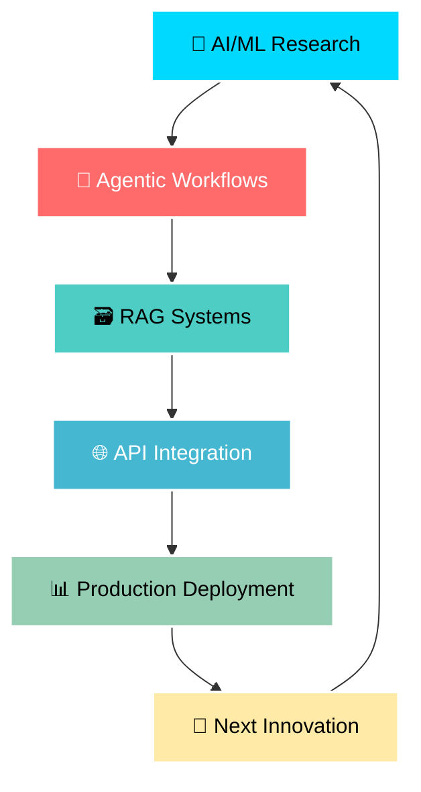

# Hi there! 👋 I'm **Arnav Srivastava** 

<div align="center">
  
</div>

<div align="center">
  
</div>

## 🚀 About Me

```python
class ArnavSrivastava:
    def __init__(self):
        self.role = "CV Engineer"
        self.passion = "AI/ML"
        self.current_focus = "Agentic Workflows & RAG Systems"
        self.motto = "Building the future, one algorithm at a time"
    
    def get_skills(self):
        return {
            "languages": ["Python"],
            "automation": ["n8n"],
            "frameworks": ["FastAPI", "LangChain", "LangGraph"],
            "ai_tools": ["STT", "TTS", "VectorDB"],
            "specialties": ["RAG", "Agentic Workflows", "API Integration"]
        }
    
    def current_projects(self):
        return "Creating intelligent automation workflows"
```

<!-- <div align="center">
  
</div> -->

## 🛠️ Tech Arsenal

<div align="center">

### 🐍 Core Technologies


### 🤖 AI/ML Stack


### 🔧 Automation & Workflow


</div>

## 🎯 What I Do

<div align="center">
  
</div>

🔹 **Agentic Workflows**: Designing intelligent automation systems that think and act  
🔹 **RAG Systems**: Building context-aware AI applications with retrieval-augmented generation  
🔹 **API Integration**: Seamlessly connecting diverse systems and databases  
🔹 **Computer Vision**: Solving real-world problems through visual intelligence  
🔹 **Voice Technologies**: Implementing STT/TTS for natural human-computer interaction  

<!-- ## 📊 GitHub Activity

<div align="center">
  
</div>

<div align="center">
  
</div> -->

## 🌟 Current Focus

<div align="center">
  
</div>



## 🎨 Featured Projects

<div align="center">

[](https://github.com/Arnav-12/Voice-OS.git)

[](https://github.com/Arnav-12/MedIntel-AI.git)

</div>

<!--## 🏆 Achievements & Metrics

<div align="center">
  
</div>

<div align="center">
  
</div>-->

## 🌐 Let's Connect & Collaborate!

<div align="center">
  
</div>

<div align="center">

[](www.linkedin.com/in/arnav-srivastava-312b24197)
<!-- [](https://twitter.com/yourhandle)-->
[](mailto:arnav.sri211@gmail.com)
<!--[](https://yourportfolio.com) -->

</div>

---

<div align="center">
  
  
  **"Innovation distinguishes between a leader and a follower"** - Steve Jobs
  
  
</div>

<div align="center">
  
</div>
